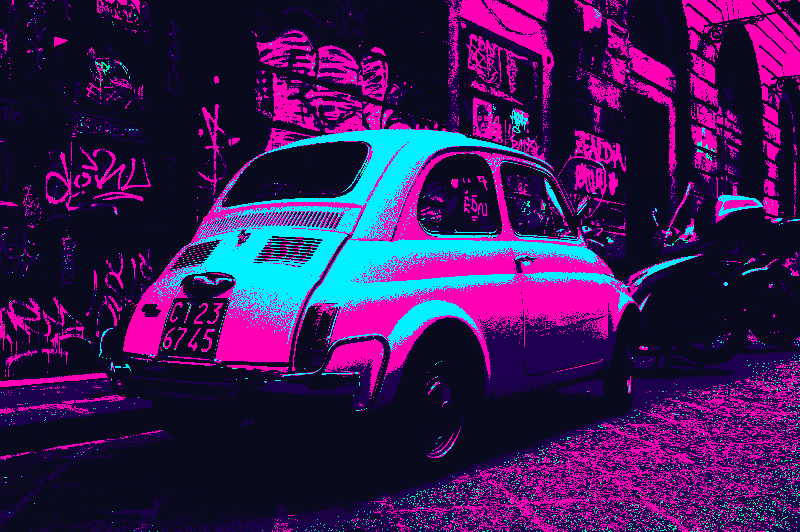

# PixelWave Editor

Transform your photos into stunning pixel art with **PixelWave Editor**, a retro-inspired image editor. Adjust pixel size, apply vibrant color palettes, and fine-tune exposure and contrast to create unique, nostalgic masterpieces.



---

## Features

- **Pixelation Control** – Adjust pixel size for a retro, 8-bit aesthetic.
- **Color Palettes** – Choose from Retro, Cyberpunk, Vaporwave, and more.
- **Image Adjustments** – Fine-tune exposure, contrast, and saturation.
- **Real-Time Preview** – Instantly see your changes.
- **Save & Export** – Export your artwork in PNG, JPEG, or BMP formats.

---

## Installation

1. **Clone the repository**:
   ```bash
   git clone https://github.com/bz1ng/pixelwave-editor.git
   cd pixelwave-editor
   ```
2. **Install dependencies**:
   ```bash
   pip install -r requirements.txt
   ```
3. **Run the application**:
   ```bash
   python main.py
   ```

---

## Usage

1. Open an image using the **"Open Image"** button.
2. Adjust **pixel size**, **color palette**, and **image settings** to your preference.
3. Preview changes in **real-time**.
4. Save your pixel art using the **"Save Image"** button.

---

## Requirements

- **Python 3.7+**
- **Libraries**:
  - `tkinter` (included with Python)
  - `Pillow` (for image processing)
  - `numpy` (for color palette calculations)

